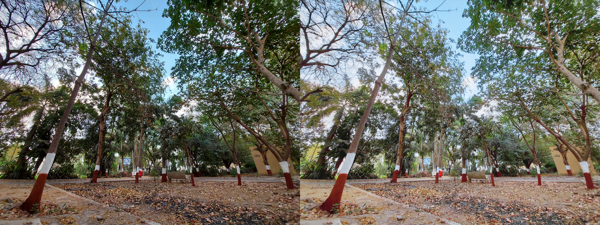
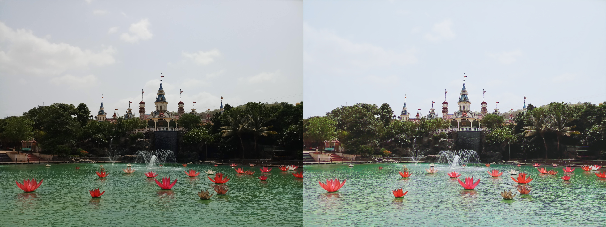
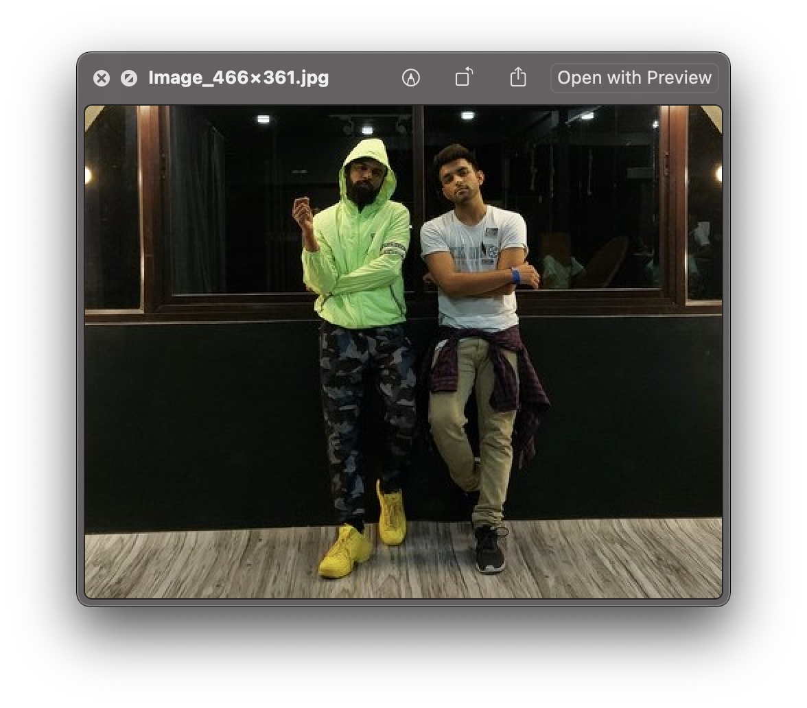
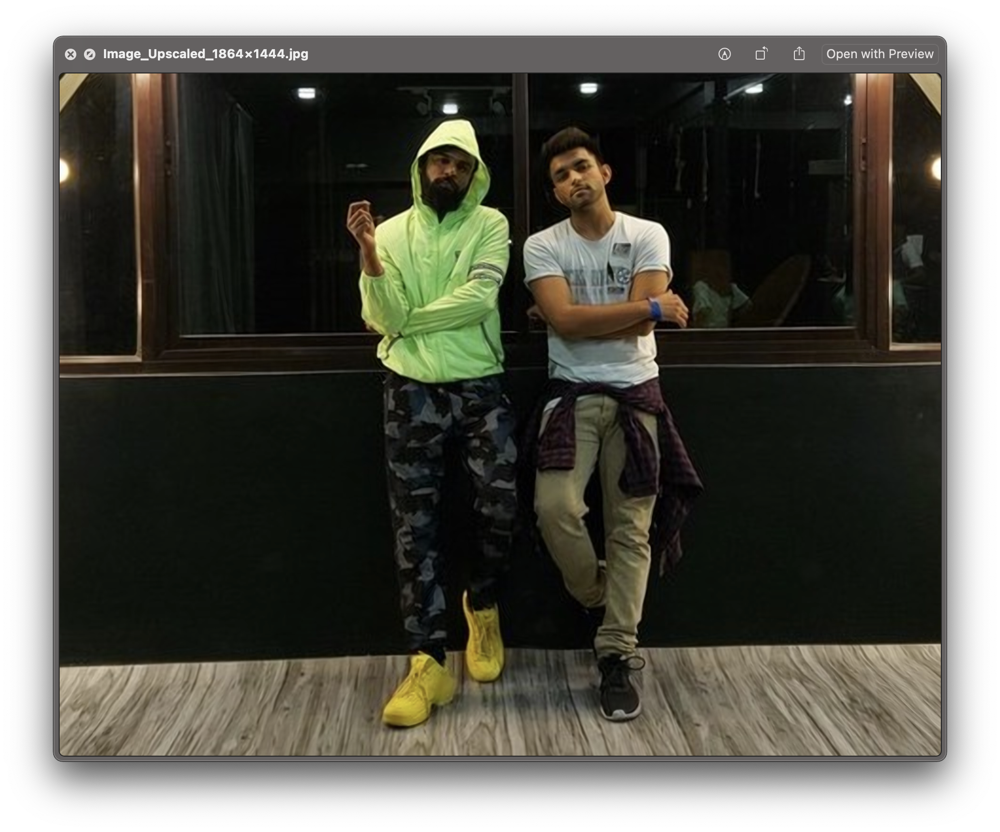

# Image-Enhancement-and-Super-Resolution

While a number of photographer tools for automatic image enhancement exist, they are usually focused on adjusting only global parameters such as contrast or brightness, without improving texture quality or taking image semantics into account. Besides that, they are usually based on a pre-defined set of rules that do not always consider the specifics of a particular device. Therefore, using neural networks to learn the translation function using a residual convolutional neural network that improves both colour rendition and image sharpness.

## Architecture Details
- Network: Generative Adversarial Networks
- Loss: 
    - Colour quality
    - Texture quality
    - Content quality
    - Total Variational Loss
- Dataset: DPED http://people.ee.ethz.ch/~ihnatova/

---

  

  

  

# Image Inpainting with Parallax Animation

    
    

